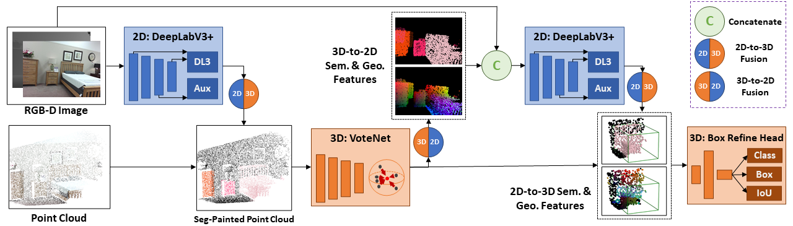

# MTC_RCNN: Multi-Modality Task Cascade for 3D Object Detection
Jinhyung Park, Xinshuo Weng, Yunze Man, Kris Kitani

This repository is the code release of [Multi-Modality Task Cascade for 3D Object Detection](https://arxiv.org/abs/2107.04013)

    

## Introduction
Point clouds and RGB images are naturally complementary modalities for 3D visual understanding - the former provides sparse but accurate locations of points on objects, while the latter contains dense color and texture information. Despite this potential for close sensor fusion, many methods train two models in isolation and use simple feature concatenation to represent 3D sensor data. This separated training scheme results in potentially sub-optimal performance and prevents 3D tasks from being used to benefit 2D tasks that are often useful on their own. To provide a more integrated approach, we propose a novel Multi-Modality Task Cascade network (MTC-RCNN) that leverages 3D box proposals to improve 2D segmentation predictions, which are then used to further refine the 3D boxes. We show that including a 2D network between two stages of 3D modules significantly improves both 2D and 3D task performance. Moreover, to prevent the 3D module from over-relying on the overfitted 2D predictions, we propose a dual-head 2D segmentation training and inference scheme, allowing the 2nd 3D module to learn to interpret imperfect 2D segmentation predictions. Evaluating our model on the challenging SUN RGB-D dataset, we improve upon state-of-the-art results of both single modality and fusion networks by a large margin (+3.8 mAP@0.5).

## Updates
Code will be released soon
